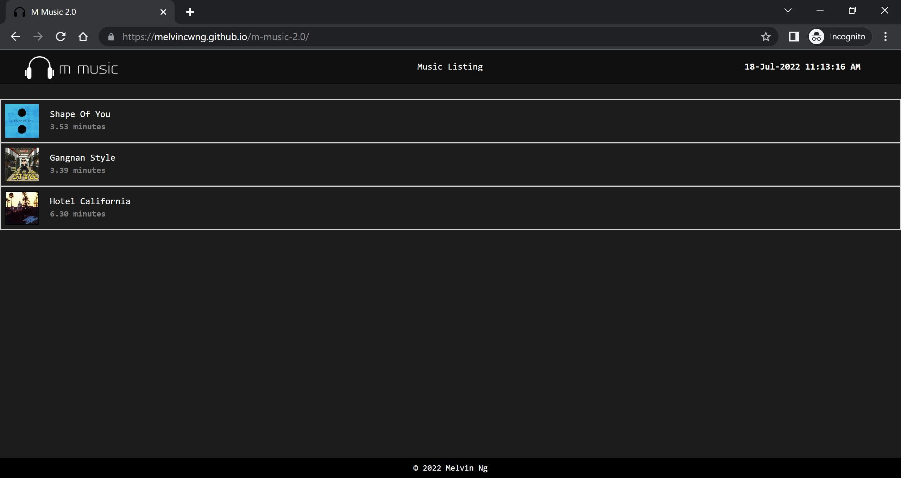

# M Music 2.0

WMP Assignment 2

This extension of the original M Music web application allows the user to do the following:

1. View a list of music fetched from a backend API endpoint
2. Click on a music/song & view it's individual details
3. Add markers for each song on a Google Map page
4. Installable as a PWA, has Service Worker functionality (caching), and has Offline support
5. Ability to receive Push Notifications
6. And **Many More...** 🤯🤯🤯 (refer to section on 'Advanced/Extra features')

M Music 2.0, like it's original version, is also a front-end web app made using HTML, CSS, JS, and jQuery.

## Languages/Tools/Libraries used:

HTML5, CSS3, Javascript, jQuery (for AJAX calls)

## Explanation of M Music 2.0's basic features:

For WMP Assignment 2, we are showed to create a webpage consisting of 3 screens:

- Listing page
- Details page
- Map page

For the Listing page, we were supposed to call a PHP endpoint (provided by the school) to fetch data containing a list of music stored in the backend server/database. Then we need to populate the returned JSON response into the UI as seen in the frontend.

For the Details page, the requirements are to display the individual song details when a user clicks on the song in the Listing page.

The Map page would allow users to add & remove 'Markers' on a Google Map. Each song will have their own individual Google Map page. The purpose of these markers for the user to take note on where a specific song can be bought in the world. It's more or less like a note-taker in short.

## Advanced/Extra features (for bonus marks)

For the bonus marks section, I've done the following:

1. **Improve UI/UX design** of the original index.html template provided (customized & integrated my own HTML/CSS)
2. **Made web app mobile responsive** to enhance user experience
3. **Added a tiny JS script (clock.js)** that displays a real time clock/timer in the UI
4. **Added a 'Music Preview' section** which showcases a short audio preview of the selected music when user navigates to the music details page
5. **Added extra JS scripts & functionality** beyond the scope of the assignment (e.g. stopAudioFromPlaying.js & add ability to click on music image to search for the music on Google)
6. **Added additional functionalities to hide, show, delete ALL markers** on the Google Map page for each song
7. **Added functionality to remove individual markers** in Google Maps as well

## Live Demo:

https://melvincwng.github.io/m-music-2.0/

